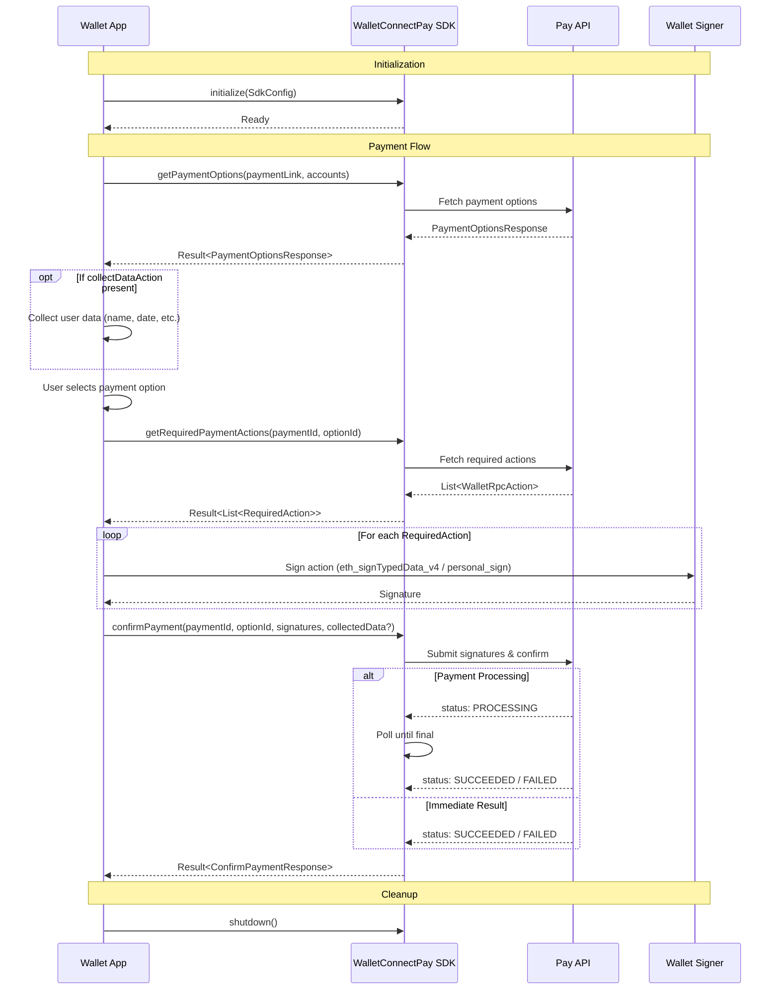

# WalletConnect Pay SDK for Android

The WalletConnect Pay SDK is a Kotlin library that enables payment functionality for Android wallet applications. This SDK provides a seamless payment solution through a native provider architecture powered by Yttrium (Rust FFI).

## Installation

```kotlin
// build.gradle.kts
implementation("com.walletconnect:pay:1.0.0")
```

### Requirements

- **Min SDK**: 23 (Android 6.0)
- **Target SDK**: 36
- **JVM Target**: 11

## Architecture

The SDK uses a native provider powered by the Yttrium Rust FFI library (`yttrium-wcpay`). This provides efficient, cross-platform payment processing capabilities while maintaining native Android performance.

## Payment Flow



### Flow Overview

1. **Initialize** - Configure the SDK with your API key and project ID
2. **Get Payment Options** - Fetch available payment methods for a payment link
3. **Collect Data** (optional) - Gather additional user information if `collectDataAction` is present
4. **Select Option** - User chooses their preferred payment option
5. **Get Required Actions** - Retrieve wallet RPC actions that need signing
6. **Sign Actions** - Sign each action using `eth_signTypedData_v4` or `personal_sign`
7. **Confirm Payment** - Submit signatures and finalize the payment
8. **Handle Result** - Process the payment status (SUCCEEDED, FAILED, PROCESSING)

## Core Usage Flow

### 1. Initialize the SDK

Initialize the SDK in your Application class or before any payment operations:

```kotlin
import com.walletconnect.pay.Pay
import com.walletconnect.pay.WalletConnectPay

WalletConnectPay.initialize(
    Pay.SdkConfig(
        apiKey = "your-api-key",
        projectId = "your-project-id",
        packageName = "com.your.app"
    )
)
```

### 2. Retrieve Payment Options

Get available payment options for a payment link:

```kotlin
val result = WalletConnectPay.getPaymentOptions(
    paymentLink = "https://pay.walletconnect.com/pay_123",
    accounts = listOf("eip155:8453:0xYourAddress")
)

result.onSuccess { response ->
    val paymentId = response.paymentId
    val options = response.options
    val paymentInfo = response.info
    val collectDataAction = response.collectDataAction
}.onFailure { error ->
    // Handle error
}
```

### 3. Get Required Actions

Get the wallet RPC actions needed to complete the payment:

```kotlin
val actionsResult = WalletConnectPay.getRequiredPaymentActions(
    paymentId = paymentId,
    optionId = selectedOption.id
)

actionsResult.onSuccess { actions ->
    actions.forEach { action ->
        when (action) {
            is Pay.RequiredAction.WalletRpc -> {
                val rpcAction = action.action
                // rpcAction.chainId - e.g., "eip155:8453"
                // rpcAction.method - e.g., "eth_signTypedData_v4" or "personal_sign"
                // rpcAction.params - JSON string with signing parameters
            }
        }
    }
}.onFailure { error ->
    // Handle error
}
```

### 4. Sign and Confirm Payment

Sign the required actions and confirm the payment:

```kotlin
// Sign each action using your wallet implementation
val signatures = actions.map { action ->
    when (action) {
        is Pay.RequiredAction.WalletRpc -> {
            val rpc = action.action
            when (rpc.method) {
                "eth_signTypedData_v4" -> wallet.signTypedData(rpc.chainId, rpc.params)
                "personal_sign" -> wallet.personalSign(rpc.chainId, rpc.params)
                else -> throw UnsupportedOperationException("Unsupported method: ${rpc.method}")
            }
        }
    }
}

// Confirm the payment with signatures
val confirmResult = WalletConnectPay.confirmPayment(
    paymentId = paymentId,
    optionId = selectedOption.id,
    signatures = signatures,
    collectedData = collectedData // Optional, if collectDataAction was present
)

confirmResult.onSuccess { response ->
    when (response.status) {
        Pay.PaymentStatus.SUCCEEDED -> {
            // Payment completed successfully
        }
        Pay.PaymentStatus.PROCESSING -> {
            // Payment is being processed
            // response.pollInMs indicates when to check again
        }
        Pay.PaymentStatus.FAILED -> {
            // Payment failed
        }
        else -> { /* Handle other statuses */ }
    }
}.onFailure { error ->
    // Handle error
}
```

### 5. Shutdown

Release SDK resources when no longer needed:

```kotlin
WalletConnectPay.shutdown()
```

## API Reference

### WalletConnectPay (Singleton Object)

The main entry point for the Pay SDK.

#### Properties

| Property | Type | Description |
|----------|------|-------------|
| `isInitialized` | `Boolean` | Indicates whether the SDK has been initialized |

#### Methods

##### `initialize(config: Pay.SdkConfig)`

Initializes the WalletConnectPay SDK.

```kotlin
fun initialize(config: Pay.SdkConfig)
```

**Parameters:**
- `config` - SDK configuration containing API key, project ID, and package name

**Throws:**
- `IllegalStateException` if already initialized

---

##### `getPaymentOptions(paymentLink: String, accounts: List<String>)`

Retrieves available payment options for a payment link.

```kotlin
suspend fun getPaymentOptions(
    paymentLink: String,
    accounts: List<String>
): Result<Pay.PaymentOptionsResponse>
```

**Parameters:**
- `paymentLink` - The payment link URL (e.g., `"https://pay.walletconnect.com/pay_xxx"`)
- `accounts` - List of account addresses in CAIP-10 format (e.g., `"eip155:1:0x..."`)

**Returns:** `Result<Pay.PaymentOptionsResponse>`

---

##### `getRequiredPaymentActions(paymentId: String, optionId: String)`

Returns wallet RPC actions needed to complete a payment.

```kotlin
suspend fun getRequiredPaymentActions(
    paymentId: String,
    optionId: String
): Result<List<Pay.RequiredAction>>
```

**Parameters:**
- `paymentId` - The payment ID from `PaymentOptionsResponse`
- `optionId` - The selected payment option ID

**Returns:** `Result<List<Pay.RequiredAction>>`

---

##### `confirmPayment(...)`

Submits signatures and finalizes the payment.

```kotlin
suspend fun confirmPayment(
    paymentId: String,
    optionId: String,
    signatures: List<String>,
    collectedData: List<Pay.CollectDataFieldResult>? = null
): Result<Pay.ConfirmPaymentResponse>
```

**Parameters:**
- `paymentId` - The payment ID
- `optionId` - The selected payment option ID
- `signatures` - List of signature strings from wallet RPC actions
- `collectedData` - Optional list of collected data field results

**Returns:** `Result<Pay.ConfirmPaymentResponse>`

---

##### `shutdown()`

Shuts down the SDK and releases resources.

```kotlin
fun shutdown()
```

## Type Definitions

### Pay.SdkConfig

```kotlin
data class SdkConfig(
    val apiKey: String,
    val projectId: String,
    val packageName: String
)
```

### Pay.PaymentStatus

```kotlin
enum class PaymentStatus {
    REQUIRES_ACTION,
    PROCESSING,
    SUCCEEDED,
    FAILED,
    EXPIRED
}
```

### Pay.PaymentOptionsResponse

```kotlin
data class PaymentOptionsResponse(
    val info: PaymentInfo?,
    val options: List<PaymentOption>,
    val paymentId: String,
    val collectDataAction: CollectDataAction?
)
```

### Pay.PaymentOption

```kotlin
data class PaymentOption(
    val id: String,
    val amount: Amount,
    val estimatedTxs: Int?
)
```

### Pay.Amount

```kotlin
data class Amount(
    val value: String,
    val unit: String,
    val display: AmountDisplay?
)

data class AmountDisplay(
    val assetSymbol: String,
    val assetName: String,
    val decimals: Int,
    val iconUrl: String?,
    val networkName: String?
)
```

### Pay.PaymentInfo

```kotlin
data class PaymentInfo(
    val status: PaymentStatus,
    val amount: Amount,
    val expiresAt: Long,
    val merchant: MerchantInfo
)

data class MerchantInfo(
    val name: String,
    val iconUrl: String?
)
```

### Pay.WalletRpcAction

```kotlin
data class WalletRpcAction(
    val chainId: String,  // e.g., "eip155:8453"
    val method: String,   // e.g., "eth_signTypedData_v4"
    val params: String    // JSON string
)
```

### Pay.RequiredAction

```kotlin
sealed class RequiredAction {
    data class WalletRpc(val action: WalletRpcAction) : RequiredAction()
}
```

### Pay.ConfirmPaymentResponse

```kotlin
data class ConfirmPaymentResponse(
    val status: PaymentStatus,
    val isFinal: Boolean,
    val pollInMs: Long?
)
```

## Handling Data Collection

Some payments require collecting additional user information. Check for `collectDataAction` in the payment options response:

```kotlin
result.onSuccess { response ->
    response.collectDataAction?.let { collectAction ->
        val collectedData = collectAction.fields.map { field ->
            // Collect data from user based on field type
            val value = when (field.fieldType) {
                Pay.CollectDataFieldType.TEXT -> getUserTextInput(field.name)
                Pay.CollectDataFieldType.DATE -> getUserDateInput(field.name)
            }
            Pay.CollectDataFieldResult(
                id = field.id,
                value = value
            )
        }

        // Pass collectedData to confirmPayment
        WalletConnectPay.confirmPayment(
            paymentId = response.paymentId,
            optionId = selectedOptionId,
            signatures = signatures,
            collectedData = collectedData
        )
    }
}
```

### Data Collection Types

```kotlin
enum class CollectDataFieldType {
    TEXT,
    DATE
}

data class CollectDataField(
    val id: String,
    val name: String,
    val fieldType: CollectDataFieldType,
    val required: Boolean
)

data class CollectDataFieldResult(
    val id: String,
    val value: String
)
```

## Error Handling

The SDK provides typed errors for different failure scenarios:

### GetPaymentOptionsError

```kotlin
sealed class GetPaymentOptionsError : Exception() {
    data class InvalidPaymentLink(override val message: String)
    data class PaymentExpired(override val message: String)
    data class PaymentNotFound(override val message: String)
    data class InvalidRequest(override val message: String)
    data class OptionNotFound(override val message: String)
    data class PaymentNotReady(override val message: String)
    data class InvalidAccount(override val message: String)
    data class ComplianceFailed(override val message: String)
    data class Http(override val message: String)
    data class InternalError(override val message: String)
}
```

### GetPaymentRequestError

```kotlin
sealed class GetPaymentRequestError : Exception() {
    data class OptionNotFound(override val message: String)
    data class PaymentNotFound(override val message: String)
    data class InvalidAccount(override val message: String)
    data class Http(override val message: String)
    data class FetchError(override val message: String)
    data class InternalError(override val message: String)
}
```

### ConfirmPaymentError

```kotlin
sealed class ConfirmPaymentError : Exception() {
    data class PaymentNotFound(override val message: String)
    data class PaymentExpired(override val message: String)
    data class InvalidOption(override val message: String)
    data class InvalidSignature(override val message: String)
    data class RouteExpired(override val message: String)
    data class Http(override val message: String)
    data class InternalError(override val message: String)
    data class UnsupportedMethod(override val message: String)
}
```

### PayError

```kotlin
sealed class PayError : Exception() {
    data class Http(override val message: String)
    data class Api(override val message: String)
    data object Timeout  // Polling exceeded maximum duration
}
```

### Example Error Handling

```kotlin
val result = WalletConnectPay.getPaymentOptions(paymentLink, accounts)

result.onFailure { error ->
    when (error) {
        is Pay.GetPaymentOptionsError.InvalidPaymentLink -> {
            showError("Invalid payment link")
        }
        is Pay.GetPaymentOptionsError.PaymentExpired -> {
            showError("Payment has expired")
        }
        is Pay.GetPaymentOptionsError.PaymentNotFound -> {
            showError("Payment not found")
        }
        is Pay.GetPaymentOptionsError.InvalidAccount -> {
            showError("Invalid account address")
        }
        is Pay.GetPaymentOptionsError.ComplianceFailed -> {
            showError("Compliance check failed")
        }
        is Pay.GetPaymentOptionsError.Http -> {
            showError("Network error: ${error.message}")
        }
        else -> {
            showError("An error occurred: ${error.message}")
        }
    }
}
```

## Complete Example

```kotlin
import com.walletconnect.pay.Pay
import com.walletconnect.pay.WalletConnectPay
import kotlinx.coroutines.launch

class PaymentViewModel : ViewModel() {

    fun initializeSdk() {
        WalletConnectPay.initialize(
            Pay.SdkConfig(
                apiKey = "your-api-key",
                projectId = "your-project-id",
                packageName = "com.your.app"
            )
        )
    }

    fun processPayment(paymentLink: String, walletAddress: String) {
        viewModelScope.launch {
            // Step 1: Get payment options
            val optionsResult = WalletConnectPay.getPaymentOptions(
                paymentLink = paymentLink,
                accounts = listOf("eip155:8453:$walletAddress")
            )

            optionsResult.onSuccess { response ->
                val paymentId = response.paymentId
                val selectedOption = response.options.first()

                // Step 2: Get required actions
                val actionsResult = WalletConnectPay.getRequiredPaymentActions(
                    paymentId = paymentId,
                    optionId = selectedOption.id
                )

                actionsResult.onSuccess { actions ->
                    // Step 3: Sign actions
                    val signatures = signActions(actions)

                    // Step 4: Collect data if required
                    val collectedData = response.collectDataAction?.let {
                        collectUserData(it.fields)
                    }

                    // Step 5: Confirm payment
                    val confirmResult = WalletConnectPay.confirmPayment(
                        paymentId = paymentId,
                        optionId = selectedOption.id,
                        signatures = signatures,
                        collectedData = collectedData
                    )

                    confirmResult.onSuccess { confirmation ->
                        handlePaymentStatus(confirmation.status)
                    }.onFailure { error ->
                        handleError(error)
                    }
                }.onFailure { error ->
                    handleError(error)
                }
            }.onFailure { error ->
                handleError(error)
            }
        }
    }

    private suspend fun signActions(actions: List<Pay.RequiredAction>): List<String> {
        return actions.map { action ->
            when (action) {
                is Pay.RequiredAction.WalletRpc -> {
                    // Implement signing logic using your wallet
                    signWithWallet(action.action)
                }
            }
        }
    }

    private fun handlePaymentStatus(status: Pay.PaymentStatus) {
        when (status) {
            Pay.PaymentStatus.SUCCEEDED -> showSuccess()
            Pay.PaymentStatus.PROCESSING -> showProcessing()
            Pay.PaymentStatus.FAILED -> showFailure()
            Pay.PaymentStatus.EXPIRED -> showExpired()
            Pay.PaymentStatus.REQUIRES_ACTION -> { /* Handle additional actions */ }
        }
    }
}
```

## Troubleshooting

### JNA Dependency Conflicts

If you encounter JNA-related errors (e.g., `UnsatisfiedLinkError` or class loading issues), you may need to explicitly configure the JNA dependency:

```kotlin
// build.gradle.kts
implementation("com.walletconnect:pay:1.0.0") {
    exclude(group = "net.java.dev.jna", module = "jna")
}
implementation("net.java.dev.jna:jna:5.17.0@aar")
```

This ensures the correct Android-specific JNA variant is used.

## ProGuard Rules

If you're using ProGuard or R8, the SDK's consumer ProGuard rules are automatically included. No additional configuration is required.

## License

Apache-2.0
